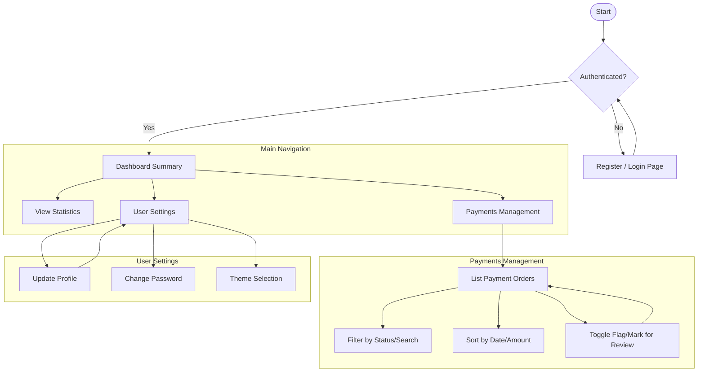
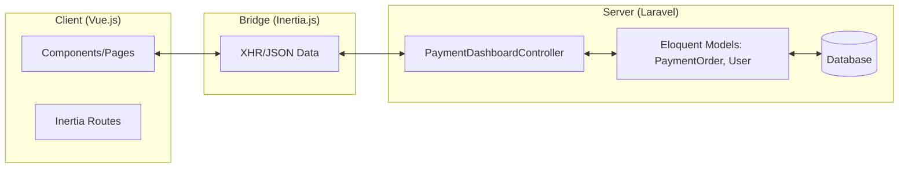
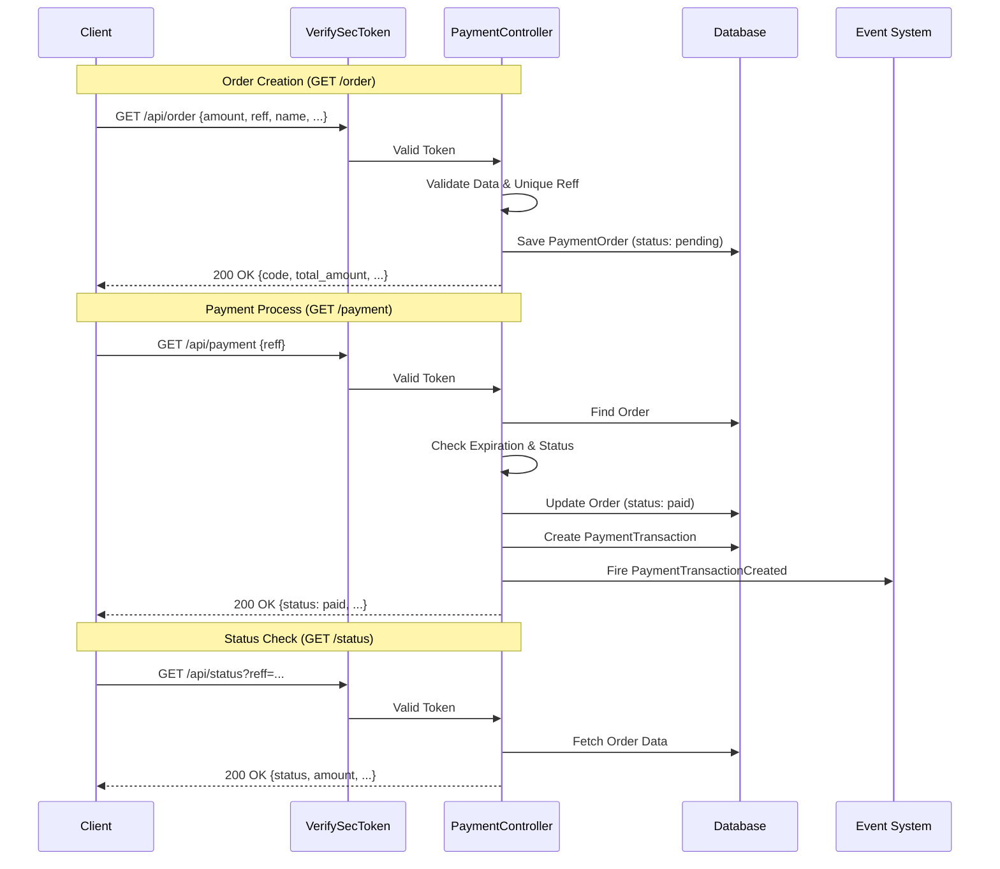

# System Design - Payment Gateway Dashboard

This document outlines the application flow and architecture of the Payment Gateway Dashboard.

## Application Flow

The following diagram illustrates the primary user flow within the application, from authentication to managing payment orders.

## Architecture Overview

The application is built using a modern stack combining Laravel for the backend and Vue.js for the frontend, synchronized via Inertia.js.

## Payment API Flow

The Payment API handles order creation, payment processing, and status inquiries through a secure endpoint.

### API Sequence Flow

## Database Entities

- **User**: System administrator or operator.
- **PaymentOrder**: Stores the details of payment requests (Amount, Status, Customer, Reference).
- **PaymentTransaction**: Detailed logs of actual transactions related to orders.
